## GitHub Stats

## Public Projects

<table>
  <thead>
    <tr>
      <th align="left">Project</th>
      <th align="left">Description</th>
      <th align="left">Technologies</th>
    </tr>
  </thead>
  <tbody>
    <tr>
      <td><a href="https://github.com/kayapater/kayauth"><strong>kayauth</strong></a></td>
      <td>A cross-platform authentication app built with .NET MAUI, featuring a modern XAML UI and MVVM-based architecture.</td>
      <td>
        
        
        
        
        
      </td>
    </tr>
    <tr>
      <td><a href="https://github.com/kayapater/video-downloader"><strong>video-downloader</strong></a></td>
      <td>A Windows app for downloading videos from 50+ platforms, with quality options, subtitle support, and pause/resume.</td>
      <td>
        
        
        
        
        
      </td>
    </tr>
    <tr>
      <td><a href="https://github.com/kayapater/qr-generator"><strong>qr-generator</strong></a></td>
      <td>A browser-based QR generator with color control, transparent background mode, and one-click PNG export.</td>
      <td>
        
        
        
        
        
      </td>
    </tr>
    <tr>
      <td><a href="https://github.com/kayapater/h2g"><strong>h2g</strong></a></td>
      <td>A real-time watch-party app where users join rooms, sync playback, manage a shared queue, and chat together.</td>
      <td>
        
        
        
        
        
      </td>
    </tr>
    <tr>
      <td><a href="https://github.com/kayapater/kickscreen"><strong>kickscreen</strong></a></td>
      <td>A multi-stream Kick.com viewer for watching several live channels on one screen with quick chat switching.</td>
      <td>
        
        
        
        
        
      </td>
    </tr>
    <tr>
      <td><a href="https://github.com/kayapater/WinKit"><strong>WinKit</strong></a></td>
      <td>A WPF utility that helps Windows users install 100+ popular apps quickly through winget, including batch installs.</td>
      <td>
        
        
        
        
        
      </td>
    </tr>
  </tbody>
</table>
