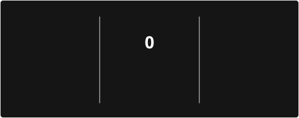

# 👋 Hi there, I'm kayapater

  
  

---

### 💫 About Me

- 🌐 **Portfolio & Live Hub:** **[kayapater.dev](https://kayapater.dev/)**
- 💻 **Desktop & Native Systems:** Developing fast desktop utilities using **.NET 8 (WPF / WinForms)** and **Tauri (Rust)**.
- 🎮 **Game Systems & Algorithms:** Architecting server engines (FiveM / Lua), voxel generators (Minecraft / Java), and CIEDE2000 color matching algorithms.
- ⚡ **Modern Web & Edge APIs:** Building high-speed responsive web apps with **React 19**, **Vite**, **Tailwind CSS**, and **Cloudflare Workers / Hono**.

---

### 🛠️ Tech Stack & Skills

<table>
  <tr>
    <td width="22%" align="center"><strong>Languages</strong></td>
    <td>
      
      
      
      
      
      
      
      
    </td>
  </tr>
  <tr>
    <td width="22%" align="center"><strong>Desktop & Systems</strong></td>
    <td>
      
      
      
      
      
    </td>
  </tr>
  <tr>
    <td width="22%" align="center"><strong>Frontend & Web</strong></td>
    <td>
      
      
      
      
      
    </td>
  </tr>
  <tr>
    <td width="22%" align="center"><strong>Backend & Edge</strong></td>
    <td>
      
      
      
      
      
    </td>
  </tr>
  <tr>
    <td width="22%" align="center"><strong>Tools & Ecosystem</strong></td>
    <td>
      
      
      
      
      
    </td>
  </tr>
</table>

---

### 🌟 Featured Projects

<table>
  <thead>
    <tr>
      <th align="left" width="28%">Project</th>
      <th align="left" width="44%">Description</th>
      <th align="left" width="28%">Technologies</th>
    </tr>
  </thead>
  <tbody>
    <tr>
      <td>
        <a href="https://www.curseforge.com/minecraft/bukkit-plugins/imagetoworld">
          <strong>Image To World</strong>
        </a>
      </td>
      <td>Photorealistic Minecraft voxel engine converting images into pixel-art structures using ISO/CIE CIEDE2000 color matching and error-diffusion dithering.</td>
      <td>
        
        
      </td>
    </tr>
    <tr>
      <td>
        <a href="https://www.curseforge.com/minecraft/bukkit-plugins/wordtoworld">
          <strong>Word To World</strong>
        </a>
      </td>
      <td>High-performance Minecraft plugin enabling 3D voxel text generation using custom anvils, 54+ solid block materials, and interactive GUI builders.</td>
      <td>
        
        
      </td>
    </tr>
    <tr>
      <td>
        <a href="https://github.com/kayapater/video-downloader">
          <strong>video-downloader</strong>
        </a>
      </td>
      <td>High-performance Windows desktop downloader supporting 50+ platforms with subtitle management, custom stream extraction, and queueing.</td>
      <td>
        
        
        
      </td>
    </tr>
    <tr>
      <td>
        <a href="https://github.com/kayapater/h2g">
          <strong>h2g</strong>
        </a>
      </td>
      <td>Real-time synchronized watch-party platform with shared video playback, live chat rooms, and collaborative queue management.</td>
      <td>
        
        
        
      </td>
    </tr>
    <tr>
      <td>
        <a href="https://github.com/kayapater/kickscreen">
          <strong>KickScreen</strong>
        </a>
      </td>
      <td>Multi-stream monitoring dashboard for Kick.com to watch multiple live broadcasts simultaneously with instant chat switching.</td>
      <td>
        
        
        
      </td>
    </tr>
    <tr>
      <td>
        <a href="https://tebex.kayapater.dev/products/1">
          <strong>FiveM Taxi Script</strong>
        </a>
      </td>
      <td>Highly optimized FiveM roleplay taxi script with custom responsive UI taximeter, dynamic call-dispatch mechanics, and clean client/server Lua architecture.</td>
      <td>
        
        
      </td>
    </tr>
    <tr>
      <td>
        <a href="https://tebex.kayapater.dev/">
          <strong>Kayapater Store</strong>
        </a>
      </td>
      <td>E-commerce store offering custom-built, performance-optimized Lua scripts, server systems, and economy architectures for FiveM.</td>
      <td>
        
        
      </td>
    </tr>
    <tr>
      <td>
        <a href="https://snopenaluminyum.com/">
          <strong>Snopen Alüminyum</strong>
        </a>
      </td>
      <td>Modern corporate web platform engineered from scratch for an architectural aluminum systems company with high-speed performance and SEO.</td>
      <td>
        
        
        
      </td>
    </tr>
    <tr>
      <td>
        <a href="https://github.com/kayapater/qr-generator">
          <strong>qr-generator</strong>
        </a>
      </td>
      <td>Client-side custom QR code studio with custom color gradients, transparency modes, and one-click high-resolution PNG export.</td>
      <td>
        
        
        
      </td>
    </tr>
  </tbody>
</table>

---

### 📊 GitHub Activity & Streak

  

---

### 🌐 Connect & Links

  
  
  
  
  

